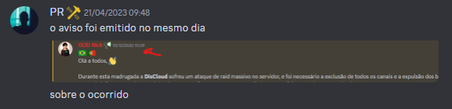

# Linn

Linn dá uma de moralista, mas sempre da a entender que ele envia informações da boca pra fora sem reciocinar ou é conivente com atrocidade, atauqes e afins.

Na mente do Linn: "Nossa a squarecloud ou envolvidos, podem atacar concorrentes, difamar, criar servidor fake de Discord para difamar concorrentes, atacar o Instagram de concorrentes, atacar Endereço IP de concorrentes, conspirações ou acusações com base em achismos/falácias, disseminar informações dissimuladas, raidar servidores Discord e dentre outras atrocidades", quando concorrentes tem algum vazamento de dados em situações esporádicas que eventualmente já solucionaram e informaram sobre o ocorrido, pra ele é o FIM DO MUNDO.

## Linn: "DisCloud não se pronucioou sobre os ataques"

`Linn` informou que estava lá no exato dia, se realmente estivesse lá, saberia dos avisos que a equipe da DisCloud fez e do ataque de raid que aconteceu, a raid deletou a maioria dos canais,cargos e afins.

## Linn: "feedbacks negativos apagados"

E em relação aos "feedbacks negativos apagados", além do ataque de raid que o servidor Discord da DisCloud recebeu, existe uma grande diferença entre feedback negativo, feedback com discurso de ódio, feedback sem nexo ( aqueles que só dizem asneiras afim de atacar e as vezes o usuário nem se quer usou o serviço ), crieo que o Linn estaja meio equivocado nas coisas que ele anda "bostejando" na web...
